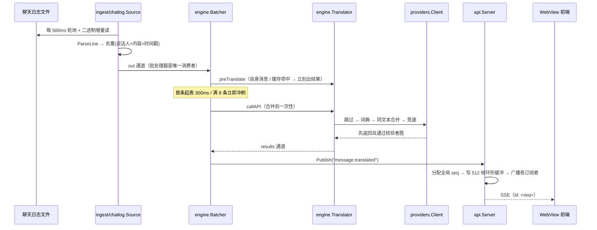
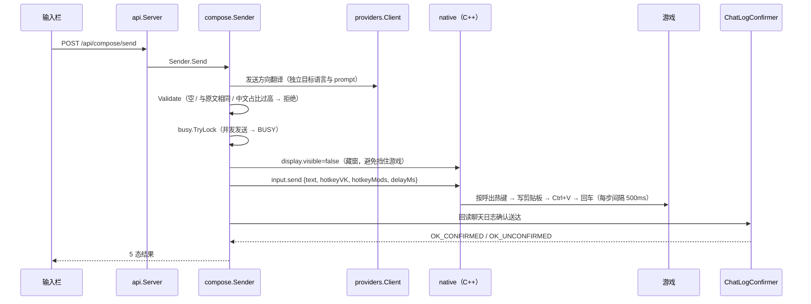
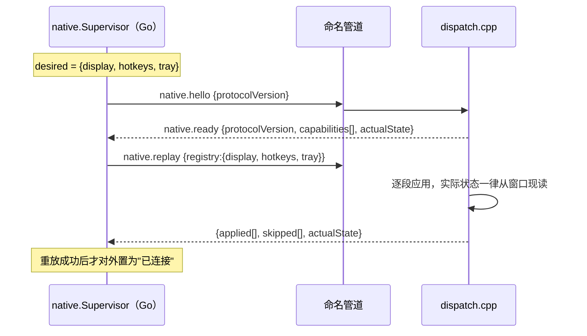

# ETS2 / TruckersMP 游戏内聊天翻译器 · V2

Euro Truck Simulator 2 · TruckersMP 联机聊天的实时翻译工具 —— 读聊天日志、翻译、显示在悬浮窗里；也能反向把中文翻译成目标语言发进游戏。

> **首要原则 P1：功能与 V1 完全一致，只更换实现。**
> V2 的功能范围 = V1 的功能范围，不多不少。

---

## 这是什么

游戏里各国玩家用母语聊天，这个工具把每一条翻译成你的目标语言，以透明悬浮窗压在游戏窗口上方。数据源是 **TruckersMP 客户端自己写出的聊天日志文件**——不注入游戏进程、不读内存、不拦截封包（见下方「安全硬约束」）。

V1 是一个 7859 行的 Python 程序（Tkinter + ctypes）。V2 用三种语言重写，按**职责**而不是按文件划分：

| 平面 | 语言 | 职责 |
|---|---|---|
| 业务大脑 | **Go** | 日志采集、翻译编排、Provider 竞速、配置、日志、REST + SSE |
| Windows 能力层 | **C++20 / MSVC** | 窗口、托盘、全局热键、输入模拟、WebView2 宿主 |
| 界面 | **TypeScript + Vue 3** | 悬浮窗与设置页，纯 SPA |

## 下载与使用

**从 [Releases](https://github.com/BunNiuNai/Euro-Truck-Simulator-2-TruckersMP-In-Game-Translator-V2/releases) 下载 `ets2-translator.exe`，双击即可运行。**

单文件、免安装、不需要旁边放任何其它文件——前端产物、Windows 能力层、词库资源都已内嵌在这一个 EXE 里。首次运行会在 `文档\ETS2 Translator V2\` 建数据目录（配置、日志、WebView2 用户数据）。

**第一次用要做的事**：程序会自动弹出设置页 → 在「API / Provider」里选一个预设（内置 20 组：硅基流动、DeepSeek、OpenAI、智谱、Kimi、豆包……）→ 填入你自己的 API Key → 保存。翻译引擎是纯 LLM，没有内置 Key。

**系统要求**

- Windows 10 1809+ / Windows 11，64 位
- **WebView2 运行时**：Win11 内置；Win10 随 Edge 一起装上，一般已具备
- 除此之外**无外部依赖**——C++ 层已静态链接 MSVC 运行库，**不需要**单独安装「Visual C++ 2015-2022 运行库」

**已知限制**：**独占全屏模式下悬浮窗不可见**（V1 同样如此），请用窗口化或无边框全屏。

## 技术栈与分层

```
TypeScript SPA (Vite)          ← native 宿主 WebView2，经 REST + SSE 通信
        │
Go 业务大脑                     ← ingest / engine / providers / dictionary / cache
        │                          config / logger / task / api
        │  Named Pipe + 长度前缀 JSON（双向 + 心跳）
C++ 纯 Win32 能力层             ← pipe / window / webview / hotkey / input / tray
```

**边界铁律**：Go 是唯一业务大脑；C++ 只做 Windows 能力，**不含业务逻辑**。托盘点了哪一项由 C++ 报告、做什么由 Go 决定，就是这个边界的一个例子。

## 模块之间怎么互相运行

### 数据流 A：游戏聊天 → 界面显示



**为什么批处理器是独立的一层，而不是塞进 `Translate` 里**：`Translate` 是同步单条入口（`internal/engine/engine.go:113`）。如果把 0.3 秒的等待窗口塞进它，消费循环会在第一条消息上就卡住，后面的消息根本没机会入批——**批次永远只有 1 条，代码看起来实现了批量、实际一次都没合并过**。V1 能攒起来，是因为它的消费线程只负责「取 + 攒 + 到期冲刷」。V2 照搬那个形状：`Batcher.Run` 独占 `out` 通道，一边取一边攒，成品从 `results` 出去（`internal/engine/batch.go:1-11`）。

**翻译这一段的内部顺序**（`Translator.callAPI`，`engine.go:336`）：非文字跳过 → 本地词典（零 API）→ 同文本并发合并 → 多 Provider 并行竞速 → 出口后处理。

这一段是**省钱的关键**：V1 的基线测量（176 条真实聊天消息）显示约 **42%** 的消息不需要调用 API（纯中文 + 词典命中 + 非文字内容），所以五层词典与混合语言拆分不能省——省掉之后这 42% 会全部开始走 API，用户会立刻感到变慢和变贵。复现工具见 `tools/fidelity/dict_fidelity.py`。

### 数据流 B：用户输入 → 翻译 → 发进游戏



发送方向的翻译与接收方向**不是同一套**：目标语言不同、system prompt 不同、且**不做分段/词典/缓存**（`internal/engine/send.go:1-13`）。这是 V1 的行为（`translator.py:906`），不能"顺手统一"。

### 数据流 C：控制面——期望状态重放（ADR-012）

Go 持有**期望状态**，native 持有**实际状态**。两者随时可能不一致（native 崩了被重启、用户手动关了窗口），所以每次连接建立后 Go 会把完整期望状态重放一遍。



**顺序很重要**：`s.client` 在重放**之后**才置位。否则调用方会看到一个「已连接但期望状态尚未重放」的中间态，此时发命令会作用在旧状态上（`internal/native/native.go:887-891`）。

### Go ↔ native 的 IPC 协议

**帧格式**：`[4 字节小端长度][UTF-8 JSON]`，单帧上限 8MB（`native/include/translator_native.h:22`）。管道名 `\\.\pipe\ets2translator-native-v1`，两端常量一致。

**握手**：Go 先发 `native.hello`，native 回 `native.ready`，携带**能力清单**。Go 据此决定哪些命令能发——缺能力时返回 `ErrCapabilityMissing` 而不是硬发（例如 native 若不是在有桌面会话的环境下启动，就不会报告 `tray` 能力）。

**心跳**：Go 每 1 秒发一次 `ping`，连续 **3 次**收不到 `pong` 判为断线并重连（`native.go:33-34`）。native 侧**没有自己的心跳定时器**，只被动应答。

**两端都必须用 overlapped I/O**——这不是性能优化，是正确性要求。Windows 会**序列化**以同步方式打开的句柄上的所有 I/O：Go 侧是"常驻读循环 + 调用方写请求"，读长期阻塞在 `ReadFile` 上时写请求会被排到它后面，双方互等，必然死锁。而且阻塞发生在系统调用内部，**Go 的 context 超时救不回来**（`internal/ipc/pipeconn.go:1-21`）。

**Go → native 的消息类型**（协议头里共定义 19 种，其中 Go **实际会发送 17 种**——`display.update` 与 `clipboard.cache` 从未被发送，后者在 native 侧也没有实现分支）：

| type | 作用 |
|---|---|
| `native.hello` | 握手 |
| `native.replay` | 全量重放期望状态 |
| `display.create` | 建窗（销毁重建） |
| `display.opacity` | 改窗口级 alpha（**不重建窗口**） |
| `display.visible` | 显示 / 隐藏 |
| `display.setClickThrough` | 鼠标穿透开关 |
| `window.blur` | 毛玻璃（Mica / Acrylic） |
| `theme.set` | 窗口材质深浅 |
| `window.beginMoveResize` | 开始一次拖动 / 缩放 |
| `window.focus` | 把窗口带到前台并聚焦 |
| `settings.open` | 打开设置窗口 |
| `hotkey.set` | 全局热键 |
| `input.send` | 模拟按键把文本发进游戏 |
| `input.copy` | 写剪贴板 |
| `tray.set` | 托盘图标与菜单 |
| `ping` | 心跳 |
| `shutdown` | 优雅退出 |

**native → Go 的事件**：`event.hotkey`、`event.trayCommand`、`event.windowChanged`、`event.settingsGeometry` 是**主动推送**（不带 id）；`native.ready`、`pong`、`event.stateChanged`、`event.error`、`event.inputResult` 是**命令回复**（带 id，与请求配对）。

**未识别的消息类型一律回 `UNSUPPORTED` 错误，绝不静默吞掉**——静默忽略会让 Go 以为命令生效了，那是最难查的一类失效（`native/src/dispatch.cpp:895-898`）。

### 前端 ↔ Go 的 REST + SSE 契约

**前端不做任何本地持久化，唯一事实源在 Go**（ADR-009）。两条通道分工明确：**命令走 REST，推送走 SSE**。

**REST**（20 条路由，全部在 `/api/` 下）：

| 路径 | 作用 |
|---|---|
| `/api/health` | 配置路径、目标语言、Provider 计数、native 是否在线、SSE 订阅数、版本 |
| `/api/config` | GET 取配置 / PUT 保存（**返回真实密钥，不脱敏**） |
| `/api/providers` | Provider 摘要列表（**不含 `api_key`**，只给 `hasKey`） |
| `/api/providers/test` | 单家连通性测试 |
| `/api/providers/models` | 拉取模型列表 |
| `/api/presets` | 20 组内置预设 |
| `/api/logs`、`/api/logs/reveal` | 日志读取 / 删除；在资源管理器里打开日志目录 |
| `/api/stats` | 翻译统计 |
| `/api/messages` | 消息快照（时间正序，用于重连补齐） |
| `/api/translate` | 单条同步翻译（不经批量器） |
| `/api/compose/send` | 手动发送全链路（翻译 + 发进游戏） |
| `/api/send` | **不翻译**、原样发进游戏 |
| `/api/ad/start`、`/api/ad/stop`、`/api/ad/status` | 广告定时发送的状态机 |
| `/api/clipboard` | 写系统剪贴板 |
| `/api/window/move` | 开始一次窗口拖动 / 缩放 |
| `/api/quit` | 退出 |
| `/api/events` | **SSE 流** |

**SSE 事件**（10 种）：`hello`（连接首帧）、`message.translated`、`stats.updated`、`source.status`、`hotkey`、`notice`、`ad.status`、`ad.log`、`config.reloaded`、`resync.required`。

#### 断线之后靠什么恢复——**两种机制，别混淆**

| 机制 | 触发场景 | 怎么做 |
|---|---|---|
| `id:` / `Last-Event-ID` **补发** | 网络抖动导致的短暂重连 | 后端每帧带自增 `id`，保留最近 512 帧；重连时浏览器自动带上 `Last-Event-ID`，后端据此补发断线期间的帧 |
| `resync.required` 控制帧 | **订阅者缓冲（256 帧）溢出**丢帧 | 后端在缓冲腾出空位后，先发一帧 `resync.required{dropped:N}` 告诉前端"你漏了 N 帧"，前端收到后重新拉快照 |

**为什么两种都要有**：补发盖不住两种情况——① **整个页面重新加载**（浏览器手里已经没有事件号了，而消息列表在 JS 内存里、刷新即清空）；② **订阅者缓冲溢出**（帧在后端就已经被丢掉了）。所以每次 SSE 连接建立（首次与每次重连），前端都会重拉一轮快照对齐。

**前端的 SSE 订阅点只有一个**。多个模块各自 `new EventSource` 会开出多条长连接，后端给每个订阅者独立的 256 帧缓冲，还可能看到不同的事件顺序。所以订阅一次、再分发给各状态模块（`frontend/src/composables/useEvents.ts:4-6`）。

## 项目结构

```
Translator-V2/
├── backend/     Go：业务大脑
├── native/      C++：Windows 能力层
├── frontend/    TypeScript SPA
├── resources/   数据（词库 / 预设 / 默认配置）——与代码分离
└── tools/       构建与验证脚本
```

### Go 包（`backend/internal/`）

| 包 | 职责 |
|---|---|
| `ingest` / `ingest/chatlog` | 聊天日志采集：轮询、切档检测、增量读、去重、解析 |
| `engine` | 接收方向编排：混合语言拆分、批量、后处理；发送方向在 `send.go` |
| `providers` | LLM 调用：并行竞速、熔断冷却、连通性测试、模型列表 |
| `dictionary` | 五层术语处理（本地命中即零 API） |
| `cache` | LRU 缓存（跨时间）+ 同文本并发合并（跨并发）——**两者不能互相替代** |
| `config` | 配置模型、DPAPI 加解密、原子写、热重载 |
| `logger` / `debuglog` | 文件日志（按天 + 按大小轮转）与细粒度调试日志 |
| `api` | REST + SSE + 静态前端托管 |
| `native` | native 主管（ADR-012）：期望状态、握手、重放、心跳、重连、能力门控 |
| `ipc` | 命名管道客户端、帧编解码、请求/响应配对 |
| `task` | 后台任务（广告发送状态机——**不在 UI 里**，关掉设置窗口也继续） |
| `compose` | 手动发送编排：翻译 → 校验 → 藏窗 → 模拟按键 → 回读确认 |
| `domain` | 跨层通信载体与错误码（错误文案与 V1 逐字一致） |
| `hotkeys` | 热键字符串解析（V1 有 4 处实现且行为不一致，V2 统一为一个） |
| `embedded` | 前端产物 / native / resources 的 `go:embed`，供单 EXE 打包 |
| `sink`、`capability` | **仅 `doc.go`，无实现**。输出实际由 `api.Server.Publish` 直发；期望状态重放的实现在 `native` |

### native 模块（`native/src/`）

| 文件 | 职责 | 线程 |
|---|---|---|
| `main.cpp` | 传输与生命周期：单实例、建管道、消息泵、收发帧 | 主线程 |
| `dispatch.cpp` | 消息 → 动作 → 回复（与传输解耦，便于测试） | 主线程 |
| `pipe.cpp` | 命名管道服务端 + 帧编解码（不做业务判断） | 主线程 |
| `json.cpp` | 自写极简 JSON DOM（只服务协议收发） | 无状态 |
| `window.cpp` | 悬浮窗 + 设置窗口（同一个类，靠 `framed` 分流）；拖动/缩放；毛玻璃 | 主线程 |
| `webview.cpp` | WebView2 宿主（两个窗口共享同一个 Environment） | 主线程 |
| `hotkey.cpp` | `RegisterHotKey` 为主、50ms 轮询降级 | 主线程 |
| `input.cpp` | `SendInput` 按键模拟 + 剪贴板 | 主线程（等待期间泵消息） |
| `tray.cpp` | 托盘图标与菜单（**只报告点了哪项**） | **自己的线程** |

## 几条关键不变量

这些是**踩过坑之后写死的**，改动前请先读代码里对应的注释。

- **`WM_CLOSE` 对悬浮窗是"隐藏"不是"销毁"。** 交回 `DefWindowProc` 会真的销毁窗口，而 Go 的期望状态里它还"可见"——用户看到的是「按了 Alt+F4 就再也回不来」（`native/src/window.cpp:983-1007`）。
- **托盘必须跑在自己的线程上。** `TrackPopupMenu` 是模态的：用户把菜单开着不放，主线程就再也读不到管道，而心跳每秒一次、超时 5 秒——连接会被判死并重连、窗口跟着重建（`native/src/tray.hpp:8-17`）。
- **窗口拖动不走系统模态移动循环**（同样会阻塞主线程），**也不用 CSS `app-region: drag`**（实测开启后真实鼠标拖动产生的位移**恒为 0**，且只支持拖动、不支持缩放）。
- **消息内容一律用 `{{ }}` 插值，永不用 `v-html`。** 玩家名与聊天内容来自联机服务器上的其他玩家，是不可信输入。V1 用 tkinter 的 `Text` 天然没有注入面，换成 WebView 之后这个面出现了。
- **竞速只给赢家记账。** 第一个成功返回的 Provider 会让其余请求被取消、并立刻返回——落败者不会被记失败。**这与 V1 逐行一致**（V1 也是首个成功就 `return`），所以一直输的那家永远不会进入熔断。这是继承来的行为，不是缺陷。
- **配置只允许一个对象。** 多处各持一份副本会互相用旧值覆盖——这类"改了没生效"的故障非常难查。
- **只有 32px 的标题带可拖动**，不是整个画布。整块画布可拖会让滚动、选中、输入全部失效。
- **全局热键只注册一个，且必须带修饰键。** `RegisterHotKey` 是**独占**不是监听：注册成功后那个键在所有程序里都不再产生正常输入。V1 从头到尾只注册一个。

## 安全硬约束（ADR-014）

**禁止任何形式的游戏进程注入与渲染 hook**：不注入 DLL、不 hook swapchain、不读写游戏内存、不拦截网络封包。只允许读取 TruckersMP 客户端自己写出的聊天日志，以及创建独立的透明置顶窗口。

理由：已核实 [TruckersMP 官方规则](https://truckersmp.com/rules) —— §2.1 以「any kind of tool」宽泛措辞禁止改变玩法的工具（6 个月至永久封禁），§1.11 规定歧义解释权在 TruckersMP，§5.2 保留随时封禁的裁量权。只读悬浮窗虽未被明文禁止，但**没有任何条款保护第三方工具**，因此按风险最小化处理。

由此产生的唯一功能限制：**独占全屏模式下悬浮窗不可见**（V1 同样如此），需要用窗口化 / 无边框全屏。

## 构建与开发

```bash
# ── Go：业务层 ──
cd backend
go build ./...
go test ./...                              # 13 个包

# ── native：Windows 能力层（需要 MSVC + Windows SDK + CMake）──
cmake -S native -B build -G "Visual Studio 17 2022" -A x64
cmake --build build --config Release
# 注意：产物输出到 dist/（RUNTIME_OUTPUT_DIRECTORY 在 native/CMakeLists.txt 里指定），
# 不在 build/ 里 —— 测试二进制也在 dist/

# ── 前端 ──
cd frontend && npm ci && npm run build     # 内部先跑 vue-tsc --noEmit

# ── 打成单个 EXE ──
powershell -File tools/build-exe.ps1 -Version "0.0.1-V2正式版"
# -SkipBuild 跳过前端与 C++ 构建，直接用现有产物重新打包
```

**工具链**：Go 1.27 · Node 25 / npm 11 · Python 3.14（资源生成脚本）· CMake 4.3 · VS Build Tools 2022（MSVC 14.44 + Windows SDK 10.0.26100）· WebView2 Runtime

> ⚠️ **`go test -race` 在本机不可用**：竞态检测器需要 cgo，而 cgo 在 Windows 上只认 gcc / clang，不认 MSVC 的 `cl.exe`。所以 `internal/cache` 这类并发代码的正确性靠**显式设计 + 用例**保证（并发合并计数、失败释放等待者、等待超时降级都有测试），不能指望 `-race` 兜底。
>
> ⚠️ **`tools/` 下的 `.ps1` 必须保存为 UTF-8 with BOM**：Windows PowerShell 5.1 会把无 BOM 的 UTF-8 脚本按本地代码页读取，中文注释会破坏语法。
>
> ⚠️ **跑 `go test ./...` 前先关掉正在运行的实例**：`internal/ipc` 的跨语言用例会启动一个 `translator_native.exe`，而 native 有单实例保护——已有实例在跑时新起的那个启动即退出，测试会卡到 5 秒超时。**形态很好认：两个用例恰好卡在 5.0 秒。**

## 已知限制与未验证

如实列出，避免让人以为"能用"就等于"全验过"：

**未验证的**

- **游戏内实际效果**：悬浮窗压在游戏画面之上、广告真的进聊天框、发送真的送达——都需要真实游戏环境
- **合成输入路径**：右键手势与键盘输入在本机的开发环境里无法验证（系统拒绝了合成鼠标输入），只能人工点
- **真实网络下的异常路径**：批量合并在真实 Provider 下、熔断冷却、网络超时——逻辑都有单元测试，但真实网络路径没跑过
- **`internal/ingest` 没有任何测试**：它是唯一的数据源（日志解析、切档、去重、服务器名识别），目前零回归保护

**已知的行为差异（相对 V1，均为有意）**

- 设置窗口的右键菜单、托盘菜单点击后的动作需要人工确认
- 窗口透明度是**整窗 alpha**，文字会跟着透明（"文字清晰"与"半透明可调"在 Windows 上互斥，除非用逐像素 alpha，而它与 WebView2 子窗口配合的代价远超收益）
- 不做游戏进程注入——这是**安全约束**不是能力缺失

---

**许可**：MIT
